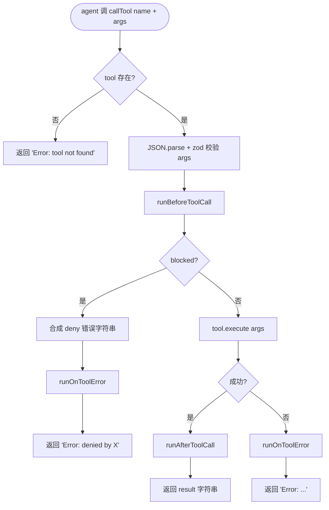

# Phase 2:Hooks 设计清单

> 这份文档**只讲设计决策和为什么**。具体实现指引和 TODO 见 [`src/hooks.ts`](../src/hooks.ts) 顶部注释。
>
> Phase 2 是第一个**没有 pguso 例子可抄**的阶段 —— 所有 API 由我们自己设计。这份文档记录决策过程,方便未来回看(和给未来 Claude 会话提供上下文)。

## 背景与目标

Phase 1 的 `callTool` 是裸跑:模型决定调 `calculator(23, 47)` → 直接执行 → 返回结果。**没有任何拦截点**,意味着:

- 看不见 tool 调用历史(无 observability)
- 危险工具(写文件、跑 bash)没有用户确认机制
- 错误处理散落在 `try/catch` 里,无法统一审计
- Phase 3 的 trace 系统没地方挂钩

**Phase 2 解决**:在 `callTool` 内部加生命周期事件链,让"观察 / 决策 / 错误处理"成为**可注册的 hook**。

---

## 5 个核心设计决策

### Q1:Hook 函数签名怎么定?

| 选项 | 签名 | 参考 |
|---|---|---|
| A | `(toolName, args) => Promise<void>`,throw 表示拒绝 | Express middleware |
| **B(选)** | `(input) => Promise<{ decision?: 'block'; reason? } \| void>` | [Claude Code Hooks](https://code.claude.com/docs/en/hooks) |
| C | `(ctx) => Promise<void>`,改 ctx 表示决策 | Koa / Vercel AI SDK |

**选 B 的理由**:
1. **决策显式**(`decision` 字段),而不是隐式 throw —— 业务拒绝和系统错误分得清楚
2. **携带 `reason`**,可以传给 LLM 让它知道**为什么**被拒,模型能道歉/重试
3. 与 Phase 1 的"错误返回字符串而非抛错"约定一致(都是数据流,不是异常流)
4. 直接对齐 Claude Code 的设计,熟悉这个 agent 就熟悉这个 API

### Q2:多个 hook 注册后,执行顺序怎么算?

| 选项 | 机制 | 参考 |
|---|---|---|
| **A(选)** | 按 `registerXxx(...)` 调用顺序 | Express、Koa、Claude Code |
| B | 显式 priority 数字 | NestJS Guards |
| C | 按类别分组(audit/permission/logger) | — |

**选 A 的理由**:
1. 零额外 API —— 代码读到哪儿执行到哪儿,最直觉
2. 真实大系统都用这个(生态印证简单方案够用)
3. 万一未来真要 priority,从 A 升 B 是 5 行改造
4. priority 数字的"留多少空间"是经典踩坑(从 1/2/3 开始用,中间想插就重排全表)

### Q3:Hook 返回 `block` 后,链怎么传播?

| 选项 | 行为 |
|---|---|
| A | 严格短路 —— 链停,什么后续事件都不触发 |
| **B(选)** | 短路 + 触发 `onToolError`(synthetic deny error) |
| C | 都跑 + 聚合 block(罕见) |

**选 B 的理由**:
1. **logger 三种结局走统一通路** ——"→ 调用 / ✓ 成功 / ✗ 错误或拒绝"是同一抽象
2. Phase 3 trace 时**白嫖** —— 拒绝也进 trace,可复盘
3. 语义清晰:**拒绝 ≈ 一种错误**

**Promise 类比**(关键洞察):

| Promise | 我们的 callTool 流程 |
|---|---|
| `new Promise(...)` | `tool.execute(args)` |
| `.then(v => ...)` | `afterToolCall` 链 |
| `.catch(err => ...)` | `onToolError` 链 |
| `Promise.reject('denied')` | hook 返回 `{decision: 'block'}` |
| 链上任何 throw / reject 跳到 `.catch` | hook 拒绝、tool 抛错,**都进 onToolError** |

**核心同构点**:错误是**数据流不是控制流**。Promise 把错误当 value 在管道里走;我们把"拒绝"和"tool 失败"都看作 onToolError 的输入。

### Q4:拒绝时 agent 看到什么?

**直接返回字符串** `"Error: denied by <hook>: <reason>"`,沿用 Phase 1 `callTool` 的错误约定(错误是 tool 结果的一种,而不是 agent 抛出的异常)。

**理由**:模型看到 `Error: ...` 字符串,可以决定:
- 道歉并停止
- 换用别的工具
- 给用户解释

如果直接抛错让 agent 崩,**agent 失去恢复机会**,违反 Phase 1 设计哲学。

### Q5:权限属性放哪儿?

| 选项 | 机制 | 参考 |
|---|---|---|
| **A(选)** | tool 自声明 `category` 字段 | Claude Code IAM、VSCode extension manifest |
| B | hook 按 tool 名字模式匹配 | — |
| C | 单独 policy 文件集中声明 | Claude Code settings.json |
| D | A + C 混合(声明 + 覆盖) | Claude Code 实际方案 |

**选 A 的理由**:
1. **新加 tool 只改 tool 文件**,不用同步更新 hook 或 policy
2. Tool 作者最清楚自己的安全级别 —— 知识放在合适的位置
3. LEARNING.md 的"read/write/bash 三类雏形"直接对应 category 值
4. 可视性强:看一眼 `tools/*.ts` 就知道哪个危险

**为什么不选 D(Claude Code 实际方案)**:Phase 2 用不上"用户配置覆盖"这种灵活性,**YAGNI**。Phase 3 / Phase 5 真有这个需求再升级,A → D 是渐进式重构。

---

## 最终 API 契约

```ts
// src/hooks.ts

export interface HookInput {
  toolName: string
  args: unknown
  result?: string            // 仅 afterToolCall 有
  error?: string             // 仅 onToolError 有(含 deny 和 tool 抛错)
}

export interface HookResult {
  decision?: 'block'         // 仅 beforeToolCall 中,hook 可以 block
  reason?: string
}

export type Hook = (input: HookInput) => Promise<HookResult | void>

// 注册函数
export function registerBeforeToolCall(hook: Hook): void
export function registerAfterToolCall(hook: Hook): void
export function registerOnToolError(hook: Hook): void

// 执行函数(给 registry.ts 用)
export function runBeforeToolCall(toolName, args): Promise<{ blocked: boolean; reason?: string }>
export function runAfterToolCall(toolName, args, result): Promise<void>
export function runOnToolError(toolName, args, error): Promise<void>
```

```ts
// src/tools/registry.ts —— Tool 接口扩展

interface Tool<T> {
  name: string
  description: string
  parameters: T
  execute: (args: z.infer<T>) => Promise<string>
  category?: 'safe' | 'read' | 'write' | 'bash' | 'network'    // 默认 'safe'
}
```

---

## 实现模式:`callTool` 改造流程



**几个隐含约定**:

1. **`runBeforeToolCall` 是唯一会"否决"的链**,after / error 都只观察
2. **after / error 中单个 hook 抛错不影响其他 hook** —— 用 try/catch 隔离
3. **after / error 不能改 result/error 值** —— 仅观察(防止 post hook 把成功改成失败的诡异行为)
4. **deny 也走 onToolError** —— 让 logger 等观察类 hook 在"三种结局"走统一逻辑

---

## 与真实系统对照

### Claude Code

Claude Code 自己有 **29 个 hook 事件**([完整列表](https://code.claude.com/docs/en/hooks)),tool 相关的核心 4 个对照如下:

| Claude Code 事件 | 我们的对应 | 备注 |
|---|---|---|
| `PreToolUse` | `beforeToolCall` | 我们的等价物 |
| `PermissionRequest` | (没做) | 这是 GUI 对话框语义,CLI 不需要 |
| `PostToolUse` | `afterToolCall` | 仅成功路径 |
| `PostToolUseFailure` | `onToolError` | 含拒绝和抛错 |

**为什么不抄 PermissionRequest**:Claude Code 是 GUI 系统,有"系统会弹对话框"这个独立动作,hook 能"代替用户决定要不要弹"。mini-agent 是 CLI,confirmHook 直接读 stdin 就完事,**多一个事件名只是空抽象**。

### Express middleware

我们的 `runBeforeToolCall` 严格短路就是 Express 的 `next()` 不调用语义。差别在 Express 用"调不调用 next"决定继续,我们用"return 什么"决定 —— 我们更显式。

### Promise

见 Q3 类比表格。**核心思想**:错误是 value 流,不是异常流。

---

## 未来演进路径

这次设计**故意留了几个口子**,以后真有需求再演化,不用现在做:

### Phase 3:加 `onToolSettled`(类似 `.finally`)

现在 logger 想"无论成功失败都记一笔",得同时注册到 `afterToolCall` 和 `onToolError`。Phase 3 加 trace 系统时,可以加 `onToolSettled` 让"无论结局"的逻辑只写一份。

### Phase 5:远程 tool 的 category 协议传递

接 MCP server 后,远程 tool 的 `category` 需要通过 MCP 协议字段传递回 client。当前 in-process 用 TS 接口字段,改远程后变成协议数据,**结构基本不变**。

### 真有 admin 配置需求 → 升级到 Option D(A + C 混合)

如果将来 user/admin 想"放开某个 tool 的 confirm",加一层 `src/permissions-policy.ts` 配置,confirmHook 先读 policy 覆盖、再读 tool.category 默认。**这是渐进式重构,不需要大改**。

### Hook 改写 args(transform 能力)

Phase 2 故意没做"hook 改 args"。如果未来需要(比如把模型给的相对路径转绝对路径、给 args 加默认值),可以让 `runBeforeToolCall` 返回 `{ args?: any }` 让后续步骤用新 args。**但这会引入"原 args vs 改后 args"的复杂度,Phase 3 trace 也得改**,暂时不做。

---

## 验证清单(全过 = Phase 2 通关)

- [ ] `pnpm dev "23 * 47"` → logger 输出 before+after,行为不变
- [ ] `pnpm dev "把 hello 写到 /tmp/x.txt"` → 模型调 write_file → confirm 弹 `[y/N]`
- [ ] 输 `y` → 真写入文件,模型说"已完成",`ls -la /tmp/x.txt` ✓
- [ ] 输 `N` → 模型说"用户拒绝",**不崩溃**,文件不存在
- [ ] 拒绝时,logger 的 `onToolError` 也触发 `"[tool] ✗ write_file failed: denied by ..."`
- [ ] tool 内部抛错(可临时让 calculator 除以 0 抛错来测)→ `onToolError` 触发,agent 收到 Error 字符串

---

## 相关文件

- [`src/hooks.ts`](../src/hooks.ts) —— 锁定决策 + API 契约 + TODO + 修改其他文件的伪代码
- [`src/tools/registry.ts`](../src/tools/registry.ts) —— 待加 `category` 字段、待改造 `callTool`
- `src/tools/write_file.ts` —— 待新建,危险工具
- [`LEARNING.md`](../LEARNING.md) Phase 2 段 —— 学习目标和自检题
